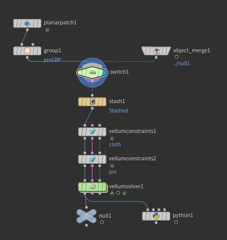

# Recursive Simulation

This was a simple experiment to check if it is possible to run a simulation infinitely long.
As you can see, when the timeline jumps back to the start frame, the simulation still runs continuously.


The basic is just a simple vellum setup.


The magic is happening in the Python SOP node:
```python
frame = hou.frame()

if frame == hou.playbar.frameRange()[1]:
    hou.node('/obj/geo1/switch1').parm('input').set(1)
    hou.node('/obj/geo1/stash1').parm('stashinput').pressButton()
```

Due to the `hou.frame()` function, the Python SOP is called on every frame, allowing us to check if the current frame is the last one. If it is, the switch node switches to 1, which is an object merge node refer to the output of the simulation geometry. This frame get stored on the stash, which the vellum nodes can use to generate new constraints for the deformed geometry, making it the first frame of our simulation. And this get reapted every time in the last frame, makes the system repeats indefinitely.